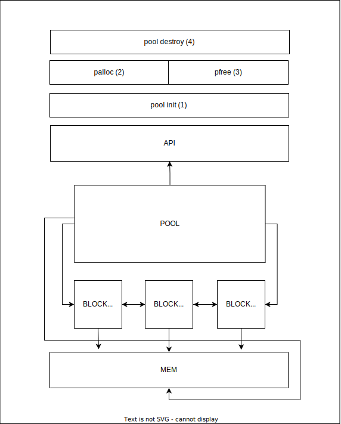

# mema (MEmory MAnager)
(Bitnie Memory Manager) Memory Manager for C language to maintain the memory allocation and dellactions and works as a memory pool

### Building blocks

The building blocks of the app is two data structs
- Block
```c
typedef struct Block
{
  void *ptr;          // pointer to the data chunk
  size_t size;        // size of the data chunk
  struct Block *next; // pointer to the next block
  struct Block *prev; // pointer to the previous block
  bool poolAllocated; // true if the block is allocated in the pool
} Block;
```

- Pool
```c
typedef struct Pool
{
  size_t allocatedCount;   // number of allocated blocks
  size_t deallocatedCount; // number of deallocated blocks
  size_t poolSize;         // BYTES: unsigned int contains the size of the pool
  size_t freeSize;         // BYTES: current pool free size
  bool initialized;        // pool is initialized, true if initialized
  void *mem;               // pointer to the first byte of the pool
  struct Block *head;      // head of the list of the allocated blocks
  struct Block *tail;      // tail of the list of the allocated blocks
} Pool;
```

### Diagram of the system



### The interface

```c
// Initialize the pool (1)
bool initPool(Pool *pool, size_t poolSize);
// Allocate memory from the pool [chunk] (2)
void *palloc(Pool *pool, size_t size);
// Free memory from the pool [chunk] (3)
bool pfree(Pool *pool, void *ptr);
// Free the pool (destroy) (4)
bool freePool(Pool *pool);
```


### Strategy
- Create Pool with size of poolSize
- Initialize the pool
  - Reserve memory for the pool `malloc(poolSize);`
  - Initialize the pool (setting the freeSize to the poolSize)
- Allocate chunk?
  - Go to the pool and create a new block
    - If the block cannot be allocated from the memory?
      - Allocate from the pool.
    - Free (to the memory) the requested chunk size from the pool if it is available.
    - Allocate the requested chunk size from the memory.
    - Connect the Block which contains a pointer to the allocated mem to the chain of the allocated blocks which is connected to the pool through the (head/tail) ptrs
- Deallocate chunk?
  - Go to the pool and free the block from the memory and the chunk as well add the size to the pool and resize the pool to the new available free size
- Free the pool
  - Go to the chain and free it
  - Free the mem of the pool from the memory
  - Free the pool

### Behind the scenes
Why did I decide that approach? I have kept on my mind the problem of memory management and the fragmentation of memory, that for example in case of I got the following order of allocation and deallocation:
POOL SIZE = 10
- a = allocate (2)
- b = allocate (4)
- c = allocate (1)
- dellocate(a)

At that point I will need to do one of the following:


- Make a layer of memory management/access so that I handle the decontinuous allocation and deallocation. It is a bit complex, considering the above example, if I tried to allocate 5 bytes I will not be able to handle it because the free size is 6 (2 at the first bytes) and 4 at the last bytes, connecting them together and returing them is not possible to be done in a simple way.

- Second one is keep tracking of the memory allocated through a linked list that is managed by a manager (the pool) and keep the area of the pool allocated and once there is a chunk of data requested freeing that from the pool and let it be taken from the memory and I make a block on my side that points to it and connect it to the pool chain was what I decided to do after a long time of thinking and actually due to the tightness of the time I decided to do it this way the make the control of the memory allocation and deallocation easier and co-managed (maintained)  by the memory.

### Build
```sh
make 
```
### Run
```sh
make run
```

### Test
```sh
make test
```

### Output
Check a snippet from are in OUTPUT.md

### Requirements
- C
- gcc 
- make

### Author
Made for Bitnine by Mohamed Mokhtar [@rrrokhtar](https://github.com/rrrokhtar)
